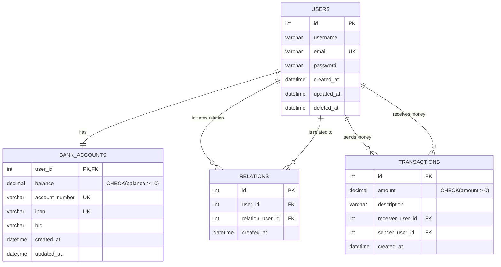

```mermaid
erDiagram
    USERS {
        int id PK
        varchar username
        varchar email UK
        varchar password
        datetime created_at
        datetime updated_at
        datetime deleted_at
    }

    BANK_ACCOUNTS {
        int user_id PK, FK
        decimal balance "CHECK(balance >= 0)"
        varchar account_number UK
        varchar iban UK
        varchar bic
        datetime created_at
        datetime updated_at
    }

    RELATIONS {
        int id PK
        int user_id FK
        int relation_user_id FK
        datetime created_at
    }

    TRANSACTIONS {
        int id PK
        decimal amount "CHECK(amount > 0)"
        varchar description
        int receiver_user_id FK
        int sender_user_id FK
        datetime created_at
    }

    USERS ||--|| BANK_ACCOUNTS : "has"
    USERS ||--o{ RELATIONS : "initiates relation"
    USERS ||--o{ RELATIONS : "is related to"
    USERS ||--o{ TRANSACTIONS : "sends money"
    USERS ||--o{ TRANSACTIONS : "receives money"
```
