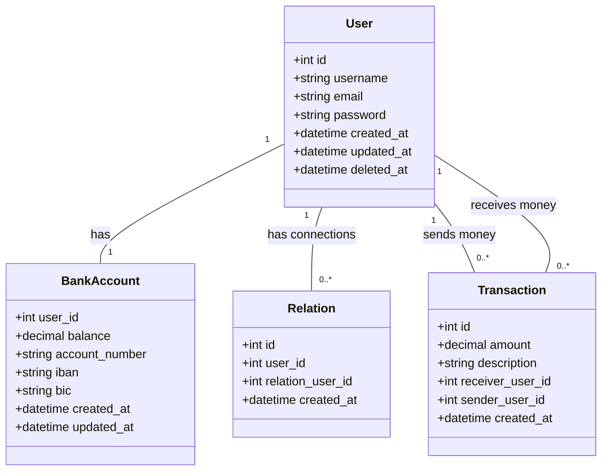

```mermaid
classDiagram
    class User {
        +int id
        +string username
        +string email
        +string password
        +datetime created_at
        +datetime updated_at
        +datetime deleted_at
    }

    class BankAccount {
        +int user_id
        +decimal balance
        +string account_number
        +string iban
        +string bic
        +datetime created_at
        +datetime updated_at
    }

    class Relation {
        +int id
        +int user_id
        +int relation_user_id
        +datetime created_at
    }

    class Transaction {
        +int id
        +decimal amount
        +string description
        +int receiver_user_id
        +int sender_user_id
        +datetime created_at
    }

    User "1" -- "1" BankAccount : has
    User "1" -- "0..*" Relation : has connections
    User "1" -- "0..*" Transaction : sends money
    User "1" -- "0..*" Transaction : receives money
```
